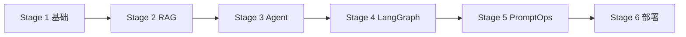

# LangChain & LLM 应用开发学习笔记

> 🎯 **目标**：系统掌握 LangChain、Agent、RAG、LangGraph 等核心技术，具备独立设计、开发、部署企业级 LLM 应用的能力。

---

## 学习路线总览

本笔记跟随 Kimi 从零开始，通过 **6 个 Stage、8 个实战项目**，覆盖市场上大模型应用开发工程师岗位的核心技能要求。

---

## 市场能力画像

| 能力维度 | 市场要求 | 出现频率 |
|---------|---------|---------|
| **Agent 框架** | LangChain、LangGraph、LlamaIndex、CrewAI、AutoGen | 70%+ |
| **RAG 全链路** | 文档解析 → Chunking → Embedding → 检索 → Re-rank → 生成 | 65%+ |
| **Tool / Function Calling** | 为 Agent 定义、注册、调用外部工具/API | 60%+ |
| **推理模式** | ReAct、Plan-and-Execute、CoT、ToT | 50%+ |
| **Prompt 工程** | 结构化设计、版本管理、效果评估 | 40%+ |
| **工程化** | Docker、FastAPI、向量数据库、LLMOps、vLLM | 75%+ |
| **前沿加分项** | MCP 协议、GraphRAG、多模态 Agent、NL2SQL | 30%+ |

---

## 学习模式

- **我来讲**：先给最小可运行示例，边跑边讲原理。
- **你来改**：基于示例做扩展任务，遇到报错一起 Debug。
- **一起做项目**：从零搭建到可演示，每个项目配 README 解说。
- **在线笔记**：所有内容整理成 Docsify 站点，随时查阅分享。

---

## 开始阅读

👉 点击左侧目录，从 [**Stage 1 · Lesson 01：Hello LangChain**](stage01/lesson01.md) 开始。
